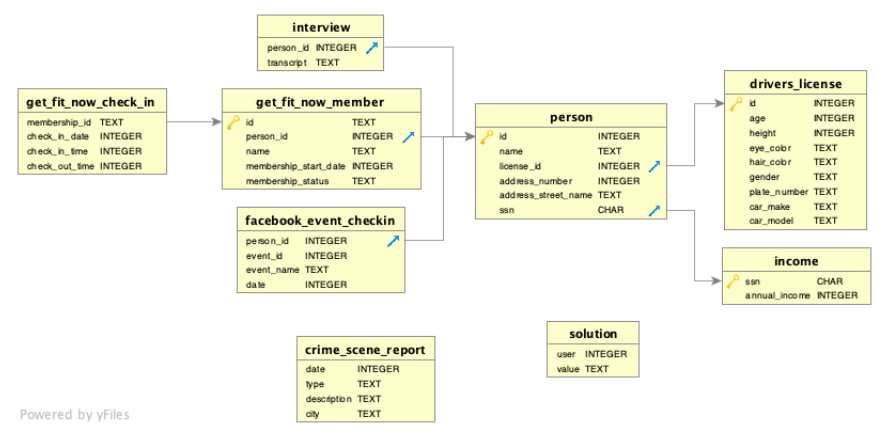

# SQL Murder Mystery

### Website of the game:

[Who is a murderer?](https://mystery.knightlab.com/walkthrough.html)

# Main Objective

There has been a Murder in the city. And I  will take the role of a detective, using SQL to uncover clues hidden across multiple tables. It is a fun and realistic simulation of how data investigation works in real life—step by step, query by query.

Here is my Entity Relationship Diagram:




## What do I have at the beginning?

I have 9 cards of information

- interview
- get_fit_now_check_in
- get_fit_now_number
- facebook_event_checkin
- person
- driver_license
- income
- crime_scene_report
- solution

## First step

To see what kind of crime we have, I'll use next command:

```sql
SELECT DISTINCT type 
FROM crime_scene_report;
```

**Answer:**
- robbery
- urder
- theft
- fraud
- arson
- bribery
- assault
- smuggling
- blackmail

## Now I am going to find the First witness

### Search using interview transcription

```sql
SELECT person_id, transcript
FROM interview
WHERE transcript LIKE '%saw the murder%';
```

**Answer:**

16371 - I saw the murder happen, and I recognized the killer from my gym when I was working out last week on January the 9th.

### Find name

``` sql
SELECT person.name, interview.transcript
FROM person JOIN interview
ON person.id = interview.person_id
WHERE person.id = 16371
```

### I will make the same step, but replace "name" to "address_street_name"

**Answer:**

Name - Annabel Miller

Address street name - Franklin Ave

## Second witness

### Here I will use the interview transcripts, but since there are too many, I’ll search using a random set of words that might be similar to the witnesses' statements.

```sql
SELECT person_id, transcript
FROM interview
WHERE transcript LIKE '%gunshot%'
   OR transcript LIKE '%run%'
   OR transcript LIKE '%Get Fit Now%'
   OR transcript LIKE '%gym%'
   OR transcript LIKE '%bag%';
```

I found an answer that suits me:

**Answer:**

person_id - 14887

Transcription - I heard a gunshot and then saw a man run out. He had a "Get Fit Now Gym" bag. The membership number on the bag started with "48Z". Only gold members have those bags. The man got into a car with a plate that included "H42W".

### Now i am going to search the name of second witness

```sql
SELECT interview.transcript, get_fit_now_member.name
FROM interview
JOIN get_fit_now_member
    ON interview.person_id = get_fit_now_member.person_id
WHERE interview.person_id = '14887';
```

**I have no answer. So, next, i will join interview with person criteria, to search the right name:**

```sql
SELECT interview.transcript, person.name
FROM interview
JOIN person
	ON interview.person_id = person.id
WHERE person_id = '14887';
```

**Answer:**

Name - Morty Schapiro

Address street name - Northwestern Dr

## Find a murderer

### Now I have clues, using interviews:

1. Murderer trains at gym.
2. His membership number started with "48Z".
3. Probably he is a gold member of that gym.
4. He has a car, whose plate number included "H42W".
5. Murder happened on January the 9th.

### Now I'll search for information by member id

``` sql
SELECT *
FROM get_fit_now_check_in
WHERE membership_id LIKE '%48Z%';
```

We know that murder happened on January the 9th, so it means, that we can use these answers in the future:

- membership_id - 48Z7A/48Z55

### I'll check name of person who has suitable id

``` sql
SELECT *
FROM get_fit_now_member
WHERE id = '48Z7A';
```

**Answer:**

- person_id - 28819
- name - Joe Germuska
- membership_status - gold

``` sql
SELECT *
FROM get_fit_now_member
WHERE id = '48Z55';
``` 

**Answer:**

- person_id - 67318
- name - Jeremy Bowers
- membership_status - gold

As we know murderer has gold member gym bag, so both of them can match by this criteria,

### I'll check information by plate number

``` sql
SELECT *
FROM drivers_license
WHERE plate_number LIKE '%H42W%';
```

**Answer:**

- id - 183779/423327/664760
- age - 21/30/21
- gender - female/male/male
- plate number - H42W0X/0H42W2/4H42WR
- car - Toyota/Chevrolet/Nissan

### Now i am going combine all data, that i found and get a conclusion

``` sql
SELECT get_fit_now_member.name, person.id, drivers_license. *
FROM get_fit_now_member
JOIN person
    ON get_fit_now_member.name = person.name
JOIN drivers_license
    ON drivers_license.id = person.license_id
WHERE plate_number LIKE '%H42W%';
```

# **Conclusion:**

The Murderer is: 

- Name - Jeremy Bowers
- ID - 67318/423327
- Age - 30y
- Height - 70
- Eye color - brown
- Hair color - brown
- Gender - male
- Car model - Chevrolet Spark LS
- Plate number -0H42W2

